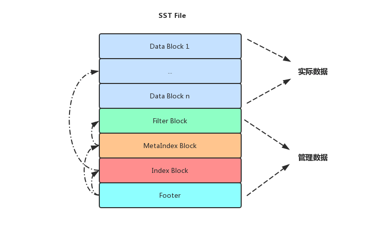
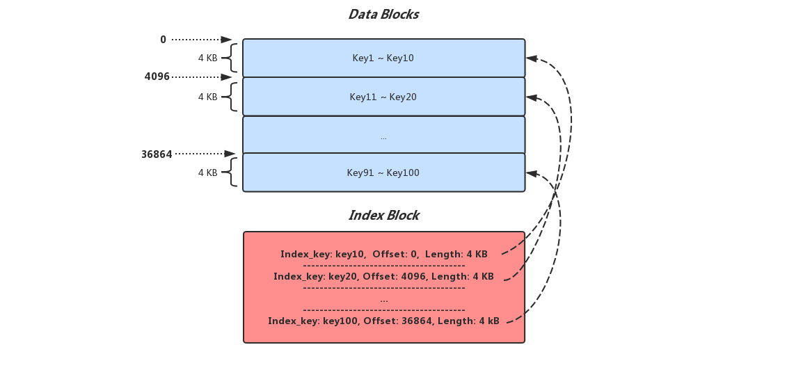
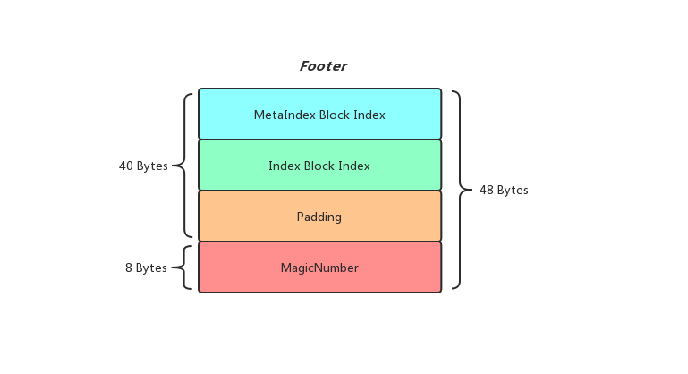

## **LevelDB的数据查询**

### 介绍
通过前面博客的介绍，我们已经对LevelDB数据存储结构以及版本控制系统有了一个比较全面的了解，在本篇博客中会对LevelDB的数据查询流程做一个梳理，也就是当我们调用LevelDB的Get()接口获取一个Key对应的Value时，LevelDB底层是怎么进行高效查询的

### 快照
在LevelDB运行期间，随着数据的不断写入，整个数据库内部的数据是不断变化的，那我们如何确保我们当前的查询操作不受查询期间数据变化的影响呢，对此LevelDB允许我们为每个查询操作设置一个snapshot，如果用户没有设置snapshot，LevelDB会默认以当前数据库的状态为这次查询操作设置一个snapshot，并且基于此来进行查询，下面代码是Get()方法内部设置snapshot的逻辑

```cpp
  MutexLock l(&mutex_);
  SequenceNumber snapshot;
  if (options.snapshot != NULL) {
    snapshot = reinterpret_cast<const SnapshotImpl*>(options.snapshot)->number_;
  } else {
    snapshot = versions_->LastSequence();
  }
```

实际上snapshot代表的就是数据库的某一个状态，前面的博客有提到过LevelDB会为我们每次写入或者删除操作分配一个序列号，而snapshot的本质就是这个序列号，如果用户对同一个key进行多次的修改(包括删除)，这些修改操作将会被转换成一系列条目进行存储，每个条目都会带上一个序列号，序列号越大的条目代表着其存储的数据越新

假设用户依次执行了三个操作`PUT("tag", "ooo")`，`PUT("tag", "xxx")`，`DELETE("tag")`三个操作，LevelDB为这三个操作分配的SequenceNumber分别为92，93，94，当前DB中tag这个Key实际上已经是被删除了的，但是我们如果以92为SnapShot去DB中进行查询的话，那么我们会得到它的Value为`"ooo"`

<center></center>

### 查询流程
LevelDB数据的写入是先写到Memtable当中，当Memtable的体积达到了用户设置的write-buffer-size之后Memtable便转换成了Immutable Memtable等待刷盘，后台线程将Immutable Memtable先Flush到Level 0层上(如果新生成的SST文件和Level 0层的其他SST文件没有overlap，那么为了避免Level 0层堆积太多SST文件降低查询效率，会直接把新生成的SST文件Flush到Level 1层上)，然后随着数据的增多LevelDB内部会在相邻的Level之间触发Major Compact，低Level的数据会经过清理合并到高Level当中.

所以我们Memtable中的数据是最新的，其次是Immutable Memtable, 最后是磁盘上的各Level的SST文件(低Level的SST文件比高Level的SST文件要新，Level 0层的SST文件有overlap，在该层中序列号大的SST文件比序列号小的SST文件要新)，所以我们是先在Memtable和Immutable Memtable中查询，若内存中没有命中我们就去磁盘进行查找，内存中的查找流程还比较简单，就是在SkipList中查询数据，就不做过多的介绍了，本篇博客着重介绍如何在磁盘中的SST文件中查找数据.

<center></center>

### SST文件
在了解如何从磁盘上查询数据之前先看一下SST文件的整体结构，SST文件中Data Block中存储着用户的数据，其他Block存储着当前SST文件的一些元信息方便快速的查询数据，当LevelDB读取一个SST文件时先会读取文件末尾的Footer，Footer中存储着Index Block和MetaIndex Block在文件中的偏移量以及大小信息，Index Block中记录了每个Data Block的索引Key以及对应Block的位置信息，而在MetaIndex Block中目前LevelDB只记录了Filter Block的位置信息，Filter Block的作用就是快速的判断一个Key是否可能存在于一个Data Block当中，由于实现原因，它只能确认一个key一定不存在，但是不能确认一个key一定存在，但是这也一定程度上提高了查询效率

<center></center>

#### Filter Block
FilterBlockBuilder是构造Filter Block的组件，实现还比较简单，内部维护了一个result\_字符串用于存储所有Filter，filter\_offsets\_记录各个Filter在result\_中的位置，在写一个Data Block的时候将Key追加到自身keys\_字符串的末尾，并且用start\_数组记录每个Key的起始位置，在Data Block写完之后就可以根据keys\_和start\_得到tmp\_keys\_，然后根据用户配置的bits\_per\_key以及tmp\_keys\_的大小分配一个Filter字符串，根据tmp\_keys\_中key计算出来的hash值将Filter中特定的bits值设置为1，最后把Filter追加到result\_的末尾并且在filter\_offsets\_中记录新Filter的位置信息

```cpp
/*
 * keys_是一个字符串, 我们新添加进来的key都依次追加到keys_字符串的后面
 * start_集合中元素的类型是整形, 存储的是keys_字符串中各个key的起始位置
 * tmp_keys_中的元素类型是Slice, Slice存储了指向keys_字符串中各个key的起始位置的指针以及当前key的长度
 *
 * e.g..
 *   我们有一组key: axl, neil, dire
 *
 *   下标:       0     1     2     3     4     5     6     7     8     9     10
 *   keys_:  |  a  |  x  |  l  |  n  |  e  |  i  |  l  |  d  |  i  |  r  |  e  |
 *   地址:      0x0   0x1   0x2   0x3   0x4   0x5   0x6   0x7   0x8   0x9   0x10
 *
 *   start_:    [0][3][7]
 *   tmp_keys_: [Slice(0x0, 3)][Slice(0x3, 4)][Slice(0x7, 4)]
 *
 */
```

下图就是FilterBlock内部的存储结构，橘黄色的部分记录的是result\_的内容，是由一系列的Filter字符串构成，绿色部分存储的是filter\_offsets\_中记录的Filter字符串的位置信息，粉色部分存储的是filter\_offsets\_的大小

<center></center>

为了例子足够简单，我们假设一个Data Block只有三个Key：`Key1`，`Key2`，`Key3`，为此我们分配了一个大小为15 bits的Filter，经过特定的Hash计算Key1，发现需要在Filter的第1，7和11 bits上置1，Key2需要在第2，8，11 bits上置1，Key3需要在4，13 bits上置1，最终该Data Block的Filter如上图所示

等到需要查询某一个Block是否存在某个Key时只需要找到该Block对应的Filter，然后通过同样的Hash算法计算该Key应该在哪几个bits上为1，如果Filter满足条件则说明Key**可能**存在于该Data Block当中，如果不满足则说明该Key**肯定**不存在于该Block当中(因为不同的Key可能计算出相同bits位置从而产生冲突，就像上面Key1和Key2在11 bits上应该都置1，可以确定的是在相同Key数量的场景下Filter越短冲突的可能性越大从而导致过滤器的作用越小，而Filter的长短是由Key的数量以及构造过滤器时传入的bits\_per\_key共同决定的，所以为了提高查询效率我们可以将bits\_per\_key设置大一点(占据磁盘空间，并且Filter Block会被加载到内存里面，空间换时间需要自己做权衡，[BlackWidow](https://github.com/Axlgrep/blackwidow)里设置的是10)

#### MetaIndex Block
在当前LevelDB中MetaIndex Block中只是记录了Filter Block在SST文件中的位置信息，很简单，这里就不做过多的阐述

#### Index Block
Index Block用于存储该SST文件中所有Data Block的索引信息，Index Block中存储着若干条记录，每条记录代表一个Data Block的索引信息，一条索引信息包含以下三种数据

* 该Data Block的Index Key，如果当前Block不是该SST文件中的最后一个Block，则Index Key需要满足的条件：`当前Block的Max Key <= Index Key < 下一个Block的Min Key`，如果当前Block是SST文件中最后一个Block则Index Key需要满足的条件：`当前Block的Max Key <= Index Key`，Index Key由`FindShortestSeparator`和`FindShortSuccessor`两个方法计算出来，当然Index Key完全可以用每个Block的Max Key替代，之所以要计算是因为用户的Key可能太长，直接放到Index Block里面可能导致占据大量的空间，况且在LevelDB运行期间Index Block是会被加载到内存里
* 该Data Block的起始位置在SST文件中的偏移量
* 该Data Block的大小

<center></center>

#### Footer
Footer可以理解为SST文件的**入口**，加载一个SST文件的时候先从Footer开始解析，为了方便解析Footer被设置成固定的48 Bytes大小，MagicNumber固定是8 Bytes，而MetaIndex Block Index和Index Block Index存储Block的位置信息是利用`紧凑型数字表示法`进行压缩存储的，所以大小并不固定，为了使Footer能够是固定的48 Bytes大小，这里引入了一个Padding，使三者大小加起来等于40 Bytes

加载SST文件的时候先读取文件末尾的48 Bytes依次解析MetaIndex Block Index和Index Block Index，这样就能顺利获取到Filter Block和Index Block，而拥有了Index Block我们就知道了该SST文件中所有Data Block的位置和对应Index Key信息了

<center></center>

### 磁盘中的数据查询
LevelDB中数据是分层的，低Level的数据要比高Level要新，所以我们的查询顺序是Level 0 -> Level 1 -> ... -> Level n，在查询Level 0层的时候，由于该层不同SST文件之间可能有overlap，我们要查询的Key可能存在于多个SST文件之中，我们先获取该层所有和查询Key有交集的SST文件，然后我们知道SST文件的序列号是单调递增的，序列号大的SST文件比序列号小的要新，所以我们对获取到的SST文件按照文件序列号由大到小进行排序，然后再依次进行查找，具体流程如下图

<center></center>

我们要查询一个SST文件的时候LevelDB会先去Table Cache中查询这个SST文件是否已经被缓存，如果没有缓存的话，会打开这个SST文件然后读取Index Block和Filter Block等信息封装成一个TableAndFile对象缓存到Table Cache当中(查询的Key就是这个SST文件的序列号)，反之就会去Table Cache中查询这个Key可能存在于那个Data Block当中(如果开启了Bloom Filter则会先通过过滤器查询这个Key是否可能存在)，获取对应的Data Block再进行具体用户数据的查询，此外LevelDB还有一个Block Cache用于缓存Data Block(如果用户没有配置，则Block Cache的大小默认是8 MB)，在Block Cache查询数据利用一个cache\_id和Data Block在SST文件中的offset信息拼接成一个16 Bytes的Key作为查询的索引Key，为的也是加快查询效率

如果我们通过Binary search在Level n层中找到没有找到符合条件的Target SST File或者Target SST File中并没有符合我们要求的数据，那么我们会移动到Level n + 1层去进行查询，如果还是没有找到则再跳到更高层去进行查找，如果找到第一个条目的类型是kTypeDeletion或者找到最高层都没有找到符合要求的条目，那么就说明这个Key不存在，反之就返回对应的Value

另外我们在[LevelDB的Compact](https://axlgrep.github.io/tech/leveldb-compact.html)介绍过LevelDB内部会按照Seek触发Compact，也就是一个SST文件通过Seek特定的次数之后就可能要触发Compact，而这个计数就是由上面这个查询过程更改的，如果我们查询了一系列的sst文件，那么查询完毕之后我们会将第一个查询的sst文件对应的allowed\_seeks值减一，如果改sst文件的allowed\_seeks小于等于0了，则进行记录等待Compact

### 总结
其实了解了LevelDB的版本控制还有SST文件结构之后再了解查询过程就不难了，为了加快查询效率LevelDB利用了Table Cache来缓存打开SST文件的Index Block和Filter Block信息，然后利用Block Cache来缓存Data Block的信息，这样在查询热Key的时候就无需从磁盘上反复的读取和解析，这实际上是用内存空间来换取时间的思想

在内存使用量方面，Block Cache和Table Cache内部都是LRU的思想，Block Cache的内存占用还比较好控制，内部就是直接使用当前占用内存大小来作为LRU的限制，但是Table Cache的内存占用就不是那么精准了，因为其内部是使用的**打开文件的个数**作为限制的，比如说最多允许你打开2000个文件，如果超过了就把最旧的一个文件关闭，并且在Table Cache中删除它的相关信息(Index Block和Filter Block等)，所以Table Cache的内存占用量实际上还和SST文件的Index Block和Filter Block相关，这也给BlackWidow实现zset自定义比较器埋下了坑，不过这都是后话了，以后的博客会提到...

