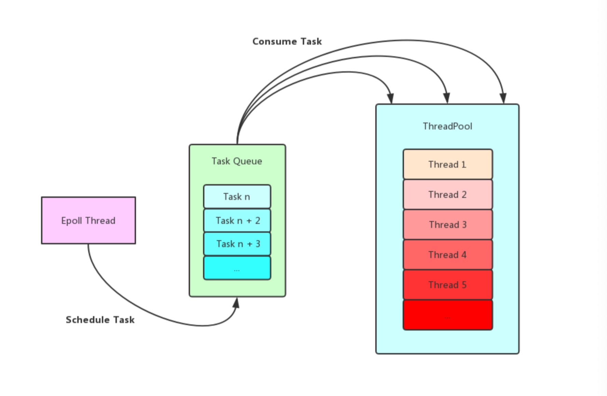
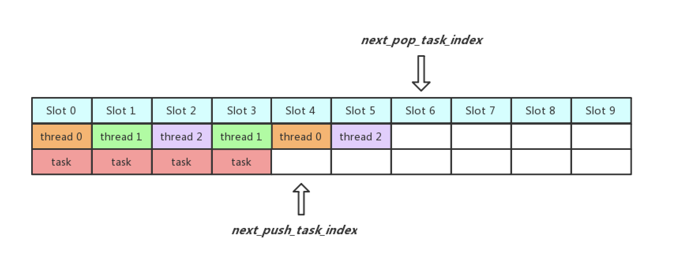
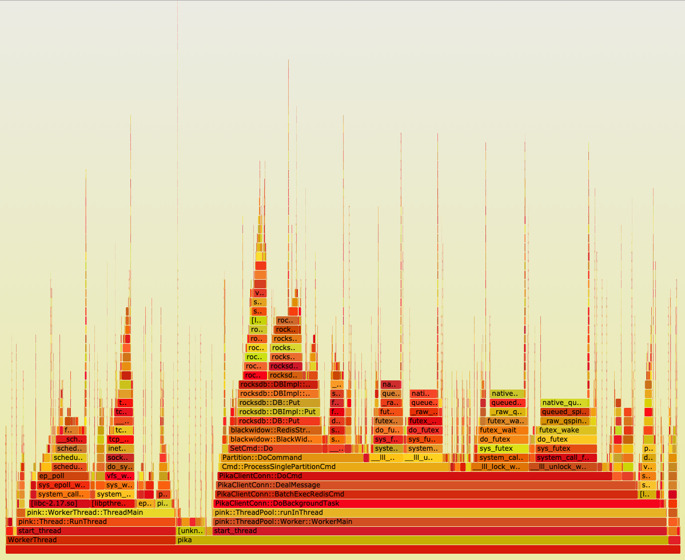

## **记录一次排查Pika性能问题**

### 背景
Pika是支持主从结构的，通过主库向从库传递Binlog来实现数据的同步，所以在主库每次处理完一条客户端的写请求的时候都需要把对应的命令写入到Binlog当中，由于Pika是多线程的，为了保证Pika的Binlog不被写花，Pika为Binlog引入了一个互斥量来对不同线程写Binlog的行为进行互斥，然而这个互斥量一直是Pika的性能瓶颈，我们利用40核的机器对Pika进行性能测试，发现QPS只能达到9w，只占用了7个核的样子，所以一直考虑是否可以把Binlog对应的这个互斥量进行细化，其实最简单的方法就是把Binlog进行拆分，将只支持单DB的Pika(一个DB对应一个Binlog)改造成支持多DB的，加上社区一直有用户反馈Redis是支持多DB的，希望Pika也能支持多DB，于是近期就对Pika进行了改造，本来是预期改完之后可以把40核的机器基本上压满的，但是实际测试下来发现QPS达到了27w, 占用了29个核, 这说明Pika内部还是有一些全局的互斥量或者是读写锁的抢占导致CPU压不满

### 怀疑是我们自己实现的线程池有问题？
原先的Pika采用同步处理请求的方式(在Epoll线程里面既处理收发Buffer的事件也处理写DB和写Binlog的事件)，挂在同一个Epoll线程上客户端的请求被顺序的执行，在这种实现下如果前面的客户端执行了重操作可能会阻塞后面客户端的请求造成延迟过高，所以我们对Pika的网络层进行了改造，添加了一个线程池来异步的处理客户端请求(将读写Buffer和写DB写Binlog进行了分离，在Epoll线程里读取Buffer，然后转换成命令封装成Task扔到线程池中执行，等任务执行完毕之后再通知Epoll线程将Reply写回给客户端)



上面是我们自己实现的线程池，可以看出Epoll线程和线程池中的工作线程操作全局任务队列都需要首先获取独占锁，如果在有大量任务密集型的场景下，这种方式的锁冲突严重，将导致大量操作系统的上下文切换，于是我将Pika内部的线程池由一个变成两个，并且每个线程池中的线程都变成原先的一半(为了尽量保持和之前单线程池一样的线程数量)，然后开始新的压测，但是发现CPU使用率和单线程池版本一样，并没有太大的改善，这说明目前线程池还不是Pika当前性能瓶颈，但是自己却对线程池的优化有了一些想法

#### 为每个工作线程分配一个单独的任务队列

实际上我们线程池之所有存在锁冲突严重的问题是因为大量的工作线程争抢同一个任务队列首先都要获取独占锁，如果我们为每一个工作线程都分配一个任务队列，然后网络线程按照一定的策略选择一个任务队列加入任务(比如内存中维护一个全局任务计数值，我们就叫task\_total，来一个新任务的时候现将task_total自增，然后通过task\_total % 工作线程数计算出该任务所属的线程，然后将任务加入该线程对应的任务队列中并且唤醒它进行消费)，然而如果有某个重任务的处理时间过长就有可能出现任务不均衡的情况，即某个线程中还有很多任务未被处理，而其他线程却处于空闲的状态，这时候我们可以再加上一些额外的策略还应对这种极端的场景，比如说每个工作线程先尝试从自己的任务队列中获取任务，如果获取失败再去查看其他工作线程的任务队列是否有任务分配给自己执行，使用这样的策略我们可以充分使用我们工作线程的处理能力

#### OCeanBase的LightyQueue

为了解决全局任务队列锁冲突的问题，OCeanBase实现了LightyQueue，其主要思想是先固定全局任务队列的大小，然后将任务队列中每一个位置看成一个槽，为每个槽都分配自己的锁，然后让工作线程在当前为其分配的槽上获取Task，通过这样的方式，可以让每个工作线程在不同的槽位上等待，避免了全局锁的冲突



假设线程池中有三个工作线程thread 0，thread 1和thread 2，全局任务队列中共有十个槽位，然后还有两个变量，一个是next\_push\_task\_index指向下一个空闲待插入任务的槽位，另一个是next\_pop\_task\_index指向下一个待消费任务的槽位，首先thread 0, thread 1和thread 2分别等待slot 0， slot 1和slot 2, Epoll线程将任务加入slot 0时唤醒thread 0, 加入slot 1时唤醒thread 1，加入slot 2时唤醒thread 2，接着，thread 1很快将任务处理完毕之后等待slot 3, thread 0等待slot 4，thread 2等待slot 5，Epoll线程将任务加到slot 3时将thread 1唤醒...

将任务添加到任务队列的操作如下:

* 占据next\_push\_task\_index指向的槽位
* 将任务加入到该槽位并且更新next\_push\_task\_index的值
* 唤醒该槽位上正在等待的工作线程(如果有的话)

工作线程从任务队列获取任务的操作如下:

* 占据next\_pop\_task\_index指向的槽位
* 如果该槽位上有任务，则获取任务并且更新next\_pop\_task\_index的值然后直接返回
* 如果改槽位上没有任务，则工作线程在该槽上等待Epoll线程向该槽上加入任务并且唤醒自身

### 利用火焰图排查问题

火焰图看起来就像一团跳动的火焰，这也正是其名字的由来，火焰图的横向是按照字母排序的函数名，每个函数的宽度占比等于它在采样中出现的次数占比(在采样期间调用同样的函数会做合并)，也就等同于它耗费时间的占比，越宽的函数表面它耗费的时间占比越大，火焰图的纵向表示调用栈的深度，上层函数被下层函数调用，最上层的函数是采样时正在占用CPU的函数，如果最上层存在很宽的函数那么该函数可能就是导致性能无法提升的罪魁祸首，我们需要对其重点分析

#### 利用Perf工具采集数据

```bash
sudo perf record -F 99 -p 5275 -g -- sleep 60
```

`perf record`表示采集系统事件并且将其记录到`perf.data`这个文件当中, `-F 99`表示表示每秒99次的频率，`-p 5275`是指定采集事件的进程号，`-g`表示启用调用图(堆栈信息)记录，`sleep 60`表示采集持续时间为60s

```bash
sudo perf script -i perf.data &> perf.unfold
```
`perf script`表示读取`perf.data`并且显示追踪信息，`-i perf.data`表示指定输入文件，如果没有这个选择则默认获取当前目录下的perf.data作为输入文件

#### 利用FlameGraph生成火焰图

```bash
git clone https://github.com/brendangregg/FlameGraph.git
```
先获取仓库

```bash
sudo FlameGraph/stackcollapse-perf.pl perf.unfold &> perf.folded
```
生成火焰图

```bash
sudo FlameGraph/flamegraph.pl perf.folded > perf.svg
```

#### 分析
从下面火焰图可以看出Pika占用CPU实际上分为两大类，一类是pink::WorkerThread主要是用于处理网络事件，读写Buffer，另外一类是pink::ThreadPool，在这里面主要处理写DB和写Binlog等操作，可以看出来在pink::WorkerThread内部CPU使用都是饱和的没有什么异常， 但是在pink::ThreadPool中PikaClientConn::DoCmd和Cmd::ProcessSinglePartitionCmd内部存在着大量的lock\_wait以及unlock\_wake占据着CPU，于是我们可以得出在这个两个方法内部可能还存在着一些全局的独占锁，这时候我们去这两个方法里面查找就能很快的发现问题了，其实不仅是写Binlog占据了独占锁，Pika还需要统计慢日志以及QPS等信息，改变这些数据都是需要上独占锁的，这也是为什么CPU跑不满的原因(通过测试，发现多个线程之间抢占读锁开销也不小)



### 总结
如果以后再遇到了性能问题，比如性能回退，可以通过在新老两个版本中画火焰图来进行对比测试，这样能很快的发现是自己哪一次改动导致的性能问题，另外Pika的线程数并不是配置的越多越好，要根据核心数来进行配置， 如果配置线程数过多可能导致系统频繁的上下文切换(查看系统上下文切换可以使用vmstat 1)，上下文切换次数过多表示你CPU大部分时间都在浪费在上下文切换，导致CPU干正经事的时间少了，这是不可取的
