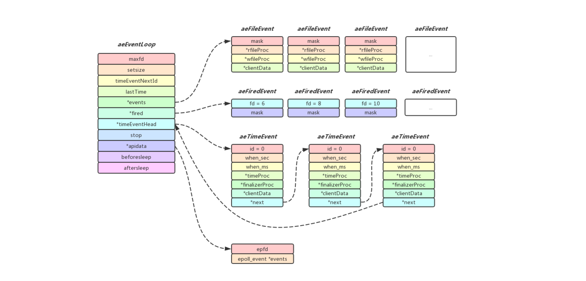

## Redis事件驱动库

### 介绍
Redis服务器是一个事件驱动程序, 事件是Redis服务器的核心, 它处理两项重要的任务, 一个是IO事件(文件事件), 另外一个是时间事件, Redis服务器通过套接字与客户端进行连接, 而文件事件可以理解为服务器对套接字操作的抽象. 服务器与客户端的通信会产生相应的文件事件, 而服务器则通过监听并处理这些事件来完成一系列网络通信操作, 另外Redis内部有一些操作(从Redis4.0的代码分析目前时间事件只有`serverCron`)需要在给定的时间点执行, 而时间事件就是Redis服务器对这类定时操作的抽象

### aeEventLoop
在分析具体代码之前, 我们先了解一下在事件处理中处于核心部分的aeEventLoop到底是什么:

```cpp
/* State of an event based program */
typedef struct aeEventLoop {
    int maxfd;                 /* highest file descriptor currently registered, 当前注册的最大fd数 */
    int setsize;               /* max number of file descriptors tracked, 允许关注fd数量的上限(就是events和fired数组的大小) */
    long long timeEventNextId  /* 下一个定时事件的ID */;
    time_t lastTime;           /* Used to detect system clock skew */
    aeFileEvent *events;       /* Registered events, 指向aeFileEvent数组, 每个fd都有对应的aeFileEvent对象(fd就是当做下标用于索引)*/
    aeFiredEvent *fired;       /* Fired events, 指向aeFiredEvent数组, 当检测到有文件事件时, 会将对应的fd和事件存放在数组里面*/
    aeTimeEvent *timeEventHead /* 指向首个时间事件结构体, 而时间事件结构体里有next指针, 指向下一个结构体, 实际上整体看上去是一个环形链表(最后一个时间事件结构体里的next指针会指向timeEventHead */;
    int stop                   /* 是否停止event loop循环 */;
    void *apidata;             /* This is used for polling API specific data, 指向底层不同多路复用实现的数据结构, 可以是epoll, select, evport或者是kqueue */
    aeBeforeSleepProc *beforesleep;
    aeBeforeSleepProc *aftersleep;
} aeEventLoop;
```

创建aeEventLoop只需要一个`setsize`参数, 它标识了当前aeEventLoop最大可以监听的文件描述符数(通常redis传入`server.maxclients+CONFIG_FDSET_INCR`, 也就是在用户指定的最大客户端连接数的基础上再额外增加128, 这128可以用于Redis内部打开AOF, RDB文件以及主从, 集群互相通信所对应的文件句柄), 创建aeEventLoop时, aeFileEvent和aeFiredEvent数组的大小就由`setsize`确定, 

* aeFileEvent: 内部以掩码的形式存储了当前套接字关心的事件(可读/可写事件), 内部还有两个函数指针指向可读/可写事件发生时应该调用的函数, 另外还有一个无类型的指针指向相关联的数据, 这里需要注意的是, events是一个数组, 而套接字就是作为下标来进行索引对应aeFileEvent, 例如我当前关心的套接字是9, 那么events[9]就是它对应的文件事件数据结构(csapp中提到过, 当我们调用系统函数返回描述符数字时, 返回的描述符总是在进程中当前没有打开的最小描述符, 所以我们无需担心文件描述符被反复的创建销毁, 而越来越大的问题)
* aeFiredEvent: 内部以掩码的形式存储了当前已经触发的事件和对应的套接字, 实际上fired数组只有在调用`aeApiPoll`的时候才会被赋值, 例如当前发现有套接字6, 8有可读事件, 而套接字10有可写事件, 那么fired数组的前三个元素会被赋值`{fd = 6, mask = AE_READABLE}, {fd = 8, mask = AE_READABLE}, {fd = 10, mask = AE_WRITABLE}`, 紧接着我们以6为索引, 找到文件事件数据结构events[6], 然后发现触发的是可读事件, 我们再调用events[6]中`rfileProc`来处理可读事件.

```cpp
aeEventLoop *aeCreateEventLoop(int setsize) {
    aeEventLoop *eventLoop;
    int i;

    if ((eventLoop = zmalloc(sizeof(*eventLoop))) == NULL) goto err;
    eventLoop->events = zmalloc(sizeof(aeFileEvent)*setsize);
    eventLoop->fired = zmalloc(sizeof(aeFiredEvent)*setsize);
    if (eventLoop->events == NULL || eventLoop->fired == NULL) goto err;
    eventLoop->setsize = setsize;
    eventLoop->lastTime = time(NULL);
    eventLoop->timeEventHead = NULL;
    eventLoop->timeEventNextId = 0;
    eventLoop->stop = 0;
    eventLoop->maxfd = -1;
    eventLoop->beforesleep = NULL;
    eventLoop->aftersleep = NULL;
    if (aeApiCreate(eventLoop) == -1) goto err;
    /* Events with mask == AE_NONE are not set. So let's initialize the
     * vector with it. */
    for (i = 0; i < setsize; i++)
        eventLoop->events[i].mask = AE_NONE;
    return eventLoop;
}
```

对于时间事件, aeEventLoop中有一个`timeEventHead`指针指向第一个时间事件, 由于aeEventLoop创建之初, 内部没有任何时间事件, 所以初始化时`timeEventHead`指向NULL, 每当有新的时间事件时, 总会被添加到`timeEventHead`头部, 由于`aeTimeEvent`结构体中有`next`指针可以指向下一个`aeTimeEvent`结构体, 所以只要我们获取`timeEventHead`就能遍历当前所有的时间事件了, 另外有一个细节需要注意, 最后一个`aeTimeEvent`结构体中的`next`指针指向的是`timeEventHead`, 所以所有时间事件实际上就是由一个环形链表串连起来的.



### 文件事件
在介绍中有提到过文件事件实际上就是服务器对套接字操作的抽象,  当套接字有可读\写事件触发的时候, 我们需要调用相应的处理函数,  下面先看一下跟文件事件相关的结构体:

```cpp
/* File event structure */
typedef struct aeFileEvent {
    int mask; /* one of AE_(READABLE|WRITABLE) */
    aeFileProc *rfileProc;  /* 指向有读事件调用的处理函数 */
    aeFileProc *wfileProc;  /* 指向有写事件调用的处理函数 */
    void *clientData;       /* 指向私有数据, 当做可读/可写函数的入参 */
} aeFileEvent;

/* A fired event */
typedef struct aeFiredEvent {
    int fd;
    int mask;
} aeFiredEvent;
```
在`aeEventLoop`初始化的时候会为`aeFileEvent `数组(`events`)分配空间, 数组的大小由参数`setsize`指定, 表明了当前Redis最大打开的套接字的大小, 套接字与`aeFileEvent`一一对应, 也就是说我们可以通过套接字数值作为索引到`events`数组中找到他对应的`aeFileEvent`对象

当我们在`aeEventLoop`中注册一个文件事件时, 首先我们判断传入的套接字对`events`数组是否有越界行为, 若没有越界行为, 我们便可以获取与当前套接字对应的`aeFileEvent`对象,  然后调用`aeApiAddEvent`将当前的文件描述符以及监听的事件注册到底层IO多路复用机制(`epoll`, `select`, `evport`, `kqueue`其中之一)中,  另外我们还需要指定当可读/可写事件发生时需要调用的函数,另外当前文件事件的一些私有数据被存放在`clientData`指向的对象当中.

```cpp
int aeCreateFileEvent(aeEventLoop *eventLoop, int fd, int mask,
        aeFileProc *proc, void *clientData)
{
    if (fd >= eventLoop->setsize) {
        errno = ERANGE;
        return AE_ERR;
    }
    aeFileEvent *fe = &eventLoop->events[fd];

    if (aeApiAddEvent(eventLoop, fd, mask) == -1)
        return AE_ERR;
    fe->mask |= mask;
    if (mask & AE_READABLE) fe->rfileProc = proc;
    if (mask & AE_WRITABLE) fe->wfileProc = proc;
    fe->clientData = clientData;
    /* 当前fd如果大于了目前的maxfd, 则需要进行更新 */
    if (fd > eventLoop->maxfd)
        eventLoop->maxfd = fd;
    return AE_OK;
}
```

### 时间事件
Redis内部的时间事件实际可以分为两类, 一类是定时事件, 也就是需要在未来某一个时间点触发的事件(只触发一次), 另外一类是周期性事件, 和前面的定时事件只触发一次不同, 周期性事件是每隔一段时间又会重新触发一次.

Redis使用了`timeProc`指向函数的返回值来判断当前属于哪类事件, 若函数返回`AE_NOMORE`(也就是-1), 说明当前事件无需再次触发(将id置删除标记`AE_DELETED_EVENT_ID`), 若函数返回一个大于等于0的值n, 说明再等待n毫秒, 该事件需要再重新被触发(根据返回值更新`when_sec`和`when_ms`), 在博客开头提到的`serverCron`时间事件实际上就是一个周期性事件, 函数末尾会返回`1000/server.hz`, `server.hz`默认被设置为`10`, 也就是说`serverCron`平均每间隔100ms会被调用一次.

```cpp
/* Time event structure */
typedef struct aeTimeEvent {
    long long id;             /* time event identifier, 定时事件的ID */
    long when_sec;            /* seconds, 定时事件下一次触发的时间(秒) */
    long when_ms;             /* milliseconds, 定时事件下一次触发的时间(毫秒) */
    aeTimeProc *timeProc;     /* 指向定时事件发生时的调用函数 */
    aeEventFinalizerProc *finalizerProc; /* 指向当当前定时事件被删除时的清理函数 */
    void *clientData;         /* 指向私有数据, 当做定时事件函数的入参 */
    struct aeTimeEvent *next; /* 指向下一个定时事件的指针 */
} aeTimeEvent;

```
Redis调用`aeCreateTimeEvent`来创建一个时间任务, 实现非常简单, 传参我们关注一下`milliseconds`和`proc`即可, 前者指定了时间事件距离当前的触发时间, 后者指定了时间事件触发时应调用的函数, 内部通过`aeAddMillisecondsToNow`将当前定时任务触发的时间戳计算出来赋值给`when_sec`和`when_ms`, 然后再将`timeProc`指向时间事件到达时应该调用的函数.

在完成了`aeTimeEvent`结构体内部变量赋值之后, 最后将其添加到`aeEventLoop`内部的存储定时间事件的环形链表的头部中(这里需要注意的是, 由于我们总是将新的时间事件加入环形链表的头部, 所以时间事件触发的时间先后并不是在环形链表中有序的, 我们需要将环形链表遍历完毕才能保证当前已经到达的时间事件都已经被处理完毕, 不过由于在开头提到过, 目前Redis只存在`serverCron`一个时间事件, 所以我们无需担心遍历环形链表影响服务性能), 此时一个时间事件就算创建完成了

```cpp
static void aeAddMillisecondsToNow(long long milliseconds, long *sec, long *ms) {
    long cur_sec, cur_ms, when_sec, when_ms;

    aeGetTime(&cur_sec, &cur_ms);
    when_sec = cur_sec + milliseconds/1000;
    when_ms = cur_ms + milliseconds%1000;
    if (when_ms >= 1000) {
        when_sec ++;
        when_ms -= 1000;
    }
    *sec = when_sec;
    *ms = when_ms;
}

long long aeCreateTimeEvent(aeEventLoop *eventLoop, long long milliseconds,
        aeTimeProc *proc, void *clientData,
        aeEventFinalizerProc *finalizerProc)
{
    long long id = eventLoop->timeEventNextId++;
    aeTimeEvent *te;

    te = zmalloc(sizeof(*te));
    if (te == NULL) return AE_ERR;
    te->id = id;
    aeAddMillisecondsToNow(milliseconds,&te->when_sec,&te->when_ms);
    te->timeProc = proc;
    te->finalizerProc = finalizerProc;
    te->clientData = clientData;
    te->next = eventLoop->timeEventHead;
    eventLoop->timeEventHead = te;
    return id;
}
```
Redis通过`aeDeleteTimeEvent`函数来删除一个时间任务, 传参只有一个待删除时间事件的id, 我们发现这里的删除实际上是一种惰性删除, 将`aeTimeEvent`中的id标记为`AE_DELETED_EVENT_ID`, 而不是直接将`aeTimeEvent`对象从链表中删除并且释放, 个人认为这么实现的原因更多是为了安全考虑以及代码的简洁性,  考虑在一个时间事件中本来想删除另外一个时间事件, 但是由于id填错, 误删成自己了, 此时如果释放自身`aeTimeEvent`对象, 这是十分危险的.

```cpp
int aeDeleteTimeEvent(aeEventLoop *eventLoop, long long id)
{
    aeTimeEvent *te = eventLoop->timeEventHead;
    while(te) {
        if (te->id == id) {
            te->id = AE_DELETED_EVENT_ID;
            return AE_OK;
        }
        te = te->next;
    }
    return AE_ERR; /* NO event with the specified ID found */
}
```

### 事件的调度与执行
Redis是单线程的,  内部是一直处于`aeMain`中的`while`循环中, 而循环内部不断调用`aeProcessEvents`函数, 该函数会对上面提到的`文件事件`和`时间事件`进行调度, 决定何时处理`文件事件`以及`时间事件` .

```cpp
void aeMain(aeEventLoop *eventLoop) {
    eventLoop->stop = 0;
    while (!eventLoop->stop) {
        if (eventLoop->beforesleep != NULL)
            eventLoop->beforesleep(eventLoop);
        aeProcessEvents(eventLoop, AE_ALL_EVENTS|AE_CALL_AFTER_SLEEP);
    }
}
```
实际上`aeProcessEvents`函数内部做的事情也非常简单, 下面进行了梳理:

1. 首先调用`aeSearchNearestTimer`获取到达时间距离当前最近的时间事件
2. 计算上一步获取到的时间事件还有多久才可以触发, 并且将结果记录到一个`struct timeval*`指针指向的结构体中(若在步骤一中没有获取到时间事件对象, 那么指针为NULL)
3. 阻塞并等待文件事件的产生, 最大的阻塞时间由步骤二决定(步骤二指针为NULL的场景表示当前没有时间事件, 我们可以永远阻塞, 直到有文件事件到达)
4. 如果在最大阻塞时间内获取到了文件事件, 则根据文件事件的类型调用对应的读事件处理函数或者写事件处理函数.
5.   遍历时间事件链表, 在这个过程中可能会遇到`id`为`AE_DELETED_EVENT_ID`的代表已经做了删除标记的时间事件, 需要将该时间事件从链表中移除, 并且进行释放,  如遇到已经达到的时间事件, 则调用其绑定的处理函数, 并且根据返回值来判断该事件时间是否需要在给定的时间内再重新触发.

### 一些问题

Q1: 时间事件触发的时间一定精准么?

A1: 时间事件的触发并不能在指定的时间精准触发, 一般都要比指定的时间稍晚一点, 此外在Redis单线程模型下, 时间事件都是串行执行的, 中间如果某个时间事件处理时间长, 更加影响了后面时间事件执行时间的精准性. 而且时间事件链表是无序的, 所以在极端场景下, 存在优先级低的时间事件比优先级高的事件先触发的可能性, 不过好在目前Redis内部只有一个时间事件, 所以影响不会太大.

---

Q2:  `aeEventLoop`在创建之初就指定了可监听文件描述符的数量, 之后又通过`config set maxclients`命令动态调整客户端最大连接数是怎么实现的?

A2:  通过翻看源码了解到, `aeEventLoop`提供了`aeResizeSetSize`函数, 用户重新分配`events`和`fired`数组的大小, 使`aeEventLoop`可监听的套接字数量得以调整, 当新的`maxclients`比原先要大的时候, 会调用该函数, 扩大`aeEventLoop`可监听文件描述符的数量, 以支持更多的客户端连接.

```cpp
int aeResizeSetSize(aeEventLoop *eventLoop, int setsize) {
    int i;

    if (setsize == eventLoop->setsize) return AE_OK;
    if (eventLoop->maxfd >= setsize) return AE_ERR;
    if (aeApiResize(eventLoop,setsize) == -1) return AE_ERR;

    eventLoop->events = zrealloc(eventLoop->events,sizeof(aeFileEvent)*setsize);
    eventLoop->fired = zrealloc(eventLoop->fired,sizeof(aeFiredEvent)*setsize);
    eventLoop->setsize = setsize;

    /* Make sure that if we created new slots, they are initialized with
     * an AE_NONE mask. */
    for (i = eventLoop->maxfd+1; i < setsize; i++)
        eventLoop->events[i].mask = AE_NONE;
    return AE_OK;
}
```

### 总结
Redis对事件的处理方式十分巧妙, 文件事件和时间事件之间相互配合, 充分的利用时间事件达到之前的这段时间等待和处理文件事件, 这样既避免了CPU的空转检查, 也能及时的处理文件事件. 此外通过时间事件中`timeProc`函数的返回值, 将时间事件的移除和再次触发权完全交给了用户,  使用起来更加灵活.


