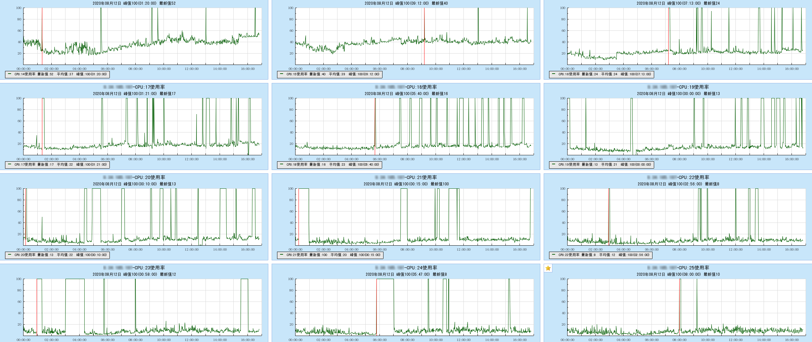
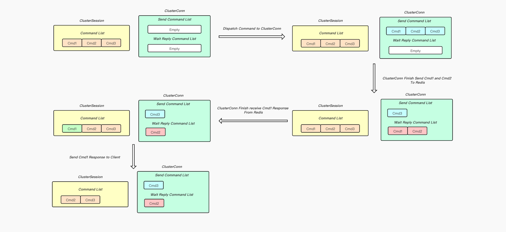
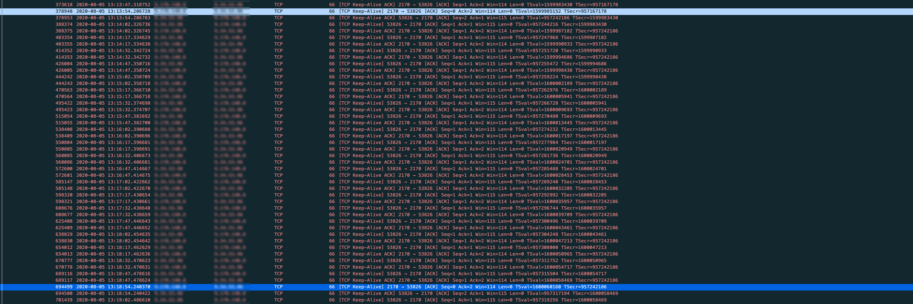
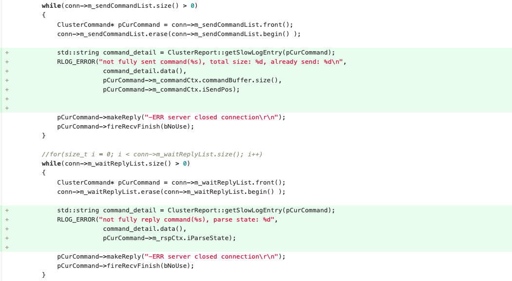

## 腾讯云Redis偶现客户端超时排查

### 问题描述
云集客户那边会偶现客户端超时的现象, 跟客户了解了相关情况之后, 确认了客户端那边设置的超时时长是2s, 有pipeline行为, 然后从客户端报错的日志来看, 是等待响应超时(`wait response timeout`), 也就是说客户发送命令之后长达2s都没有收到proxy这边的响应, 十分诡异.

### 初步分析
接到问题之后我们首先看了一下用户执行的命令, 发现用户没有类似`keys *`这种很重的命令(用户是集群版, 目前也不支持`keys *`), 所以单个命令执行时长超过2秒肯定是不正常的, 紧接着我们又从Proxy上报的slowlog来看, 发现用户出现超时之后的一段时间, 几乎在同一个时刻上报了上百条耗时长达17分钟的slowlog, 并且这一批slowlog都来自于同一个Proxy结点.

根据以往的经验, 耗时这么夸张的slowlog基本都是由于单个客户端连接卡死了, 并且客户端当前持有了很多还未完成的命令(这和用户有pipeline的行为相吻合), 在卡死了很长一段时间之后, 连接断开, Proxy会将这条连接还未完成的命令一起上报slowlog, 这个时候距离接收命令可能已经过了很长一段时间了(很可能达到了前面提到的17分钟)

由于之前proxy确实存在过在大request或者大response场景下协议解析的bug(已读取数据在连接的buffer中由于解析bug无法被消费, 导致该连接直接被卡死, 此外, 由于proxy中的epoll采用了` Level Triggered`模式, 被卡死的连接如果还有未接收的数据, 会一直通知有可读事件产生, 导致了CPU空转, 出现单核被打满现象), 最终导致客户端单个连接卡死的问题, 于是我们到产生slowlog的proxy机器上查看问题发生时的CPU使用情况, 找遍了所有的核, 并没有发现被打满的情况, 于是基本排除了是由于之前proxy解析bug导致的连接卡死(如果是协议解析的bug, cpu监控图应该如下, 有单核cpu被打满的现象).

 

我们还发现在上报慢日志的proxy节点上, 有日志表明当时有一条ClusterConn(后端连接, Proxy <---> Cache)断开, 并且日志表明这条后端连接并不是处于连接池当中的空闲连接, 而是被ClusterSession(前端连接, Client <---> Proxy)持有的, 通过监控, 我们发现用户之前也出现了几次客户端超时的问题, 我们到对应的proxy上都发现了ClusterConn异常断开的日志, 所以当时严重怀疑ClusterConn的断开和用户客户端出现超时报错存在某种联系.

```cpp
[ClusterConnPool.cpp][973]redis server conn error closed:9.178.140.8:2439
[ClusterConnPool.cpp][1024]reids conn closed with client session attach
```

此外, 这条日志是在proxy中的`processNetError`函数中打印的, 该函数有多个入口,  有可能后端连接发送命令或者接收回复失败, 或者是建连失败, 或者是连接异常(发生`EPOLLHUP | EPOLLERR`事件), 都会调到`processNetError`, 但是如果是由于后端发送命令或者是接收回复失败导致调用`processNetError`, 应该有其他更多日志打印出来, 但是在我们的日志中并没有出现, 所以我们基本可以排除前两种原因, 将入口缩小为建连失败或者是连接异常.

### 命令处理流程
下面先梳理一下Proxy对客户端发来请求的处理流程:

1. ClusterSession将从客户端接收到的命令按照先后顺序存放在自己维护的`CommandList`中.
2. ClusterSession将已经成功接收的命令分发给ClusterConn, ClusterConn会将这些命令按照顺序放到自己维护的`SendCommandList`当中, 等待转发给Redis.
3. ClusterConn将已经完全转发给Redis的命令从`SendCommandList`中移除, 并且按先后追加到`WaitReplyCommandList`末尾, 等待接收Redis的回复.
4. 当已经从Redis获取到一条命令的返回结果, 将该条命令从`WaitReplyCommandList`头部移除, 并且通知ClusterSession将对应的命令返回结果写回给客户端.
5. 当命令结果完全写回给客户端, 将该条命令从ClusterSession的`CommandList`中移除



如果在处理过程中, 后端连接异常关闭了, ClusterConn会将当前自身持有的命令(`SendCommandList`和`WaitReplyCommandList`中的命令)的回复都设置为`-ERR server closed connection\r\n`, 及时告知客户端当前连接出问题了.

### 第一次抓包

由于监控信息和日志能够获取到的信息不足以定位问题, 而用户客户端超时的问题很可能继续出现, 于是我们便在Proxy和Cache都部署了抓包, 等待问题再次复现, 不到半天, 问题果然复现了, 和之前一样, 出问题的时候日志中也显示有后端连接出现了断连:


由于出问题之前我们部署了抓包程序, 从抓包数据中我们获取了更多的线索:

1. 我们发现了在Cache测的抓包中存在一个后端连接的`RST`的包, 我们猜测这个由于`RST`包异常断开的连接就是我们日志中打印的那条异常断开的连接, 但是我们仔细比对了时间, 发现连接异常断开的日志是在`2020-8-5 13:25:16`打印的, 但是`RST`包却是在`2020-8-5 13:27:46`产生的, 有点可疑, 但是我们再深入分析, 发现`RST`包的产生是由于Cache到了300s给我们发送的`KeepAlive`触发的. 很可能在此之前, 这条连接早已异常了, 也就是说proxy在`2020-8-5 13:25:16`检测到了连接异常, 此时打印了日志, 但是到了`2020-8-5 13:27:46`Cache给Proxy发送`KeepAlive`包, 这时才发现连接异常, 产生了`RST`包, 这么解释是完全说得通的.
2. `RST`包的产生时间和proxy打印连接异常断开的日志对不上的问题分析清楚之后, 这条连接还有一个可疑的点是, 在这个后端连接异常断开之前很长的一段时间, Proxy既没有给Cache发送数据包, 也没有给Cache发送`KeepAlive`包(`KeepAlive`包只有在没有数据包发送的时候才会产生, 否则数据包自身有`KeepAlive`的功能), 但是在此期间Cache给我们回的`KeepAlive`包我们是可以正常响应ACK的, 这说明连接当时还是存活的. 
3. 另外我们追踪了出现超时的客户端的TCP流, 发现在客户端超时之后, 连接并没有立即断开, 并且之后Proxy给客户端回复了`-ERR server closed connection\r\n`, 这说明当时有后端连接异常关闭, 并且当时后端连接中的`SendCommandList`或者`WaitReplyCommandList`中有未处理完的命令, 这个信息让我们完全确认了日志所在的`processNetError`函数是由于连接异常断开才调用的, 因为集合既然有未处理完的命令, 这说明后端连接早已建立成功. 排除了由于建连失败调用的`processNetError`, 但是由于proxy日志不全面, 我们并不能确认未处理完的命令到底处于哪个集合当中.


我们在Proxy --> Cache方向上的`SO_KEEPALIVE`我们设置的是15s, 而Cache --> Proxy方向是设置的`SO_KEEPALIVE`是300s,  所以如果一个连接空闲情况下, 应该按照下面抓包截图一样, Proxy每隔15s给Cache发送一个`KeepAlive`包, Cache给我们回`Keep-Alive Ack`, Cache每隔300s给Proxy发送一个`KeepAlive`包, Proxy给Cache回`Keep-Alive Ack`.

像上面截图中从`2020-08-05 13:12:45`到`2020-08-05 13:27:46`长达15分钟里, 只有Cache给Proxy发`Keep-Alive`(`TCP/IP 详解 卷一`中对`Keep-Alive`的描述是: 如果在一段时间(称为保活时间, keepalive time)内连接处于非活动状态, 开启保活功能的一端将向对方发送一个探测报文)包, Proxy没有发出任何数据包和`Keep-Alive`给Cache实在让人匪夷所思



问题查到这里, 我们已经严重怀疑是操作系统或者是硬件问题导致的了(由于出问题的Proxy我们发现都是部署在AEP新硬件机器上的, 怀疑是不是对新硬件的兼容或者其他原因导致的bug), 这时候我们采取了两个措施:

* 联系客户, 将部署在AEP新硬件机器上的Proxy迁移到相对老的比较稳定的机器上, 以防万一, 怕迁移到稳定机器之后还是继续出现问题, 我们抓包没停, 并且在Proxy中加了更加详细的日志, 方便再次出现问题时可以精准定位.
* 拉了`h_tlinux_Helper`的同学, 将我们当前的问题进行描述, 以及将抓包信息同步给他们协助排查问题.

我们还是想弄清楚在后端连接异常断开时到底是`SendCommandList`还是`WaitReplyCommandList`里面有堆积, 于是我们在处理连接异常的逻辑中添加了两行日志, 分别打印出在后端连接断开时`SendCommandList`中堆积的命令, 包括命令大小以及已经发送出的字节数, 以及`WaitReplyCommandList`中堆积的命令, 以及命令返回结果的状态, 对Proxy改动如下:



### 第二次抓包
本以为迁移到其他机器上之后问题会消失, 没想到云集客户端超时的问题不就之后又复现了, 但是客户告知我们发现问题的时间距离问题实际发生的时间已经过了半个多小时, 我们上去对每个proxy执行`netstats`已经看不到任何异常了, 还好抓包没停, 我们分析slowlog, 抓包信息, 发现现象和之前完全一致, 基本可以断定是同一个问题, 这次由于部署了新版本的Proxy, 我们发现了更多的信息.


从日志来看, 在后端连接异常断开的时候`SendCommandList`里已经堆积了好几百条命令, 再仔细分析, 我们发现是由于`SendCommandList`列表中第一个命令没有完全发送出去, 导致后面的命令被堆积了.

第一个命令有一个特点, 就是特别大, 总体积达到了74103 Bytes, 但是我们发送了46336 Bytes之后, 后面的就没有再继续发送了, 最终堆积的这一系列命令都拿不到response, 和云集客户端等待响应超时(`wait response timeout`)是能够对的上的, 这时候我们有了两个怀疑的方向:

1. Proxy代码出bug了, 没有把命令完全转发到Cache, 就把监听socket可写事件取消了, 导致就算我们虽然还有需要传给Cache的命令, 但是由于没有监听可写事件, 一直没有写出去. 但是经过我们对代码的反复确认, 基本排除了这种可能性.
2. 监听了socket的可写事件, 但是Cache端RevQ有堆积, 给Proxy返回了`ZeroWindow`导致Proxy没有可写事件触发, 无法将剩下的数据传送给Cache, 但是自己是感觉就算Cache端有包堆积, 也不至于堆积这么久, 直接导致连接卡死, 否则就是Cache真的有Bug? 好在问题发生的时候我们在Proxy和Cache侧都是有抓包的, 但是从抓包分析, 在问题发生的时间段, 没有任何`ZeroWindow`包产生.

我们两个怀疑的方向都被推翻之后, 这个问题仿佛走进了死胡同, 这时我们将焦点集中在了Proxy打的下面这条日志中:

```cpp
not fully sent command(set item_subject.56216 {"benefitPoint":"","categoryIds":"","componentInfos":"[{\"type\":\"fixItems\",\"value\":[11495]},{\"type\... (73975 more bytes)), total size: 74103, already send: 46336
```

这条日志说明用户当时执行一个`set`命令,  key是`item_subject.56216`, value比较大, 使整个请求达到了将近73k, 但是我们发送了不到46k后面的就没有发了.

虽然命令没能完全发送, 但是从`already send: 46336`这段日志可以肯定的是至少`set item_subject.56216`这段数据是已经发出去了的, 我们尝试在Cache侧的包和Proxy测的包来寻找有这段数据的TCP包, 但是竟然一条符合要求的记录都没有.

问题查到这, 感觉手头这些信息和推导出的结论有点超出我的认知了:

1. 一直监听可写事件, 对端从来没有给我回`ZeroWindow`,  但是这条连接一直没有可写事件产生.
2. 数据已经写到socket里面去了, 但是在抓包中完全找不到符合要求的记录.

### 冷静一下
这时候我们又重新对云集这几次出现问题获取的线索进行梳理和分析:

1. 我们对上报超长慢日志的proxy和后端异常断连的cache进行了分析, 发现几次出现问题上报超长慢日志的proxy并不只有一个, 并且后端异常断连对应的cache也不是一个, 这说明并不是由于总是一个结点故障导致的问题.
2. 一开始有怀疑是不是最近的proxy发版引入bug导致的问题, 但是这个猜测很快被推翻了, 因为另外一个实例也出现了相同的问题, 我们上去看了这个实例出问题proxy二进制的最后修改时间, 发现是去年11月份.
3. 重新整理了一下几次发生问题时proxy打印的日志, 我们发现问题发生时都有一个后端连接异常断开, 并且在连接异常断开时`SendCommandList`列表里都有堆积, 堆积的原因都是由于第一个超大的`set`请求没有发送完毕, 我们还发现问题先后出现了四次, 都集中在key是`item_subject.56216`和`item_subject.64509`的请求上, 前者value为70k, 后者value为80k, 紧接着我们随机扫描了一些其他同类型的key, 发现其他的key对应的value都只有十多二十k, 基本上可以肯定客户端超时问题是由于大请求导致的.
4. 从proxy日志表明, 我们已经把大请求的前面部分内容写入socket成功了, 但是cache端没有收到, 并且从proxy测抓包来看, 这段数据并没有经网卡发送出去.
5. 通过查看问题发生时proxy对应机器的监控信息, 发现没有单核被打满的现象, 也排除了proxy由于redis协议解析的bug导致了CPU的空转然后连接卡死的问题.

### 问题再次出现, 这次有现场!
当天晚上客户在群里又反馈说发现了客户端超时的问题, 我们发现问题刚刚发生, 立马登录机器对用户实例的proxy进行`netstat`一一排查, 排查到第三个proxy时, 果然发现问题了, 发现有一条Proxy --> Cache方向的连接`SendQ`有堆积:


为了证明`SendQ`并不是偶尔有堆积, 而是一直卡死, 自己多截了几张现场的图, 并且把时间戳也带上了:


从截图可以发现从`2020-08-05 21:08:43`到`2020-08-05  21:11:17`, 有一条连接的`SendQ`一直堆积了52128 Bytes的数据, 一个字节都没有消费.


赶紧再登录到Cache的机器上看一下这条连接的情况:


发现Cache端这条连接`RcvQ`和`SendQ`都是空的, 没有任何数据堆积, 这时候我们可以完全排除应用层的问题了, 也能成功解释之前我们数据已经成功写入套接字, 但是在抓包中却没有找到这段数据的疑问, 因为Proxy --> Cache这条连接上的数据已经到了操作系统, 但是并没有经由网卡发送出去, 所以抓包我们抓不到, 然后由于是一直有数据待发送的, 所以Proxy --> Cache这个方向上也不会发送`KeepAlive`包, 只会响应对端给自己发送的`KeepAlive`, 和我们之前观察到的现象完全一致.

这时感觉问题上升到了操作系统层面, 于是赶紧将现场截图发给内核组同学排查, 他们经过确认之后, 发现操作系统内核之前的某一些版本确实存在对大包处理的一个bug, 这个内核bug是在`Kernel-tlinux2-0049`引入的, 然后在`Kernel-tlinux2-0051`进行了修复, 紧接着我们确认了一下出问题proxy机器对应的内核版本, 发现就是`Kernel-tlinux2-0049`.

问题确认之后, 内核给了我们针对这个问题修复的热补丁, 我们将云集实例对应的proxy机器把热补丁打上, 后续便没有再出现类似问题了.

### 总结
经历过这次线上问题排查, 自己有如下收获:

1. proxy内部日志要尽量打全, 这样等到出现问题的时候才有利于快速定位.
2. 如果怀疑是其他组件或者是服务的问题时, 要找出证据进行证明, 这样更加严谨.
3. 对自己负责的项目代码要加深了解, 另外要自信, 相信自己的服务是稳定的.
4. 持续学习, 将计算机相关基础知识打牢, 这个非常重要.
